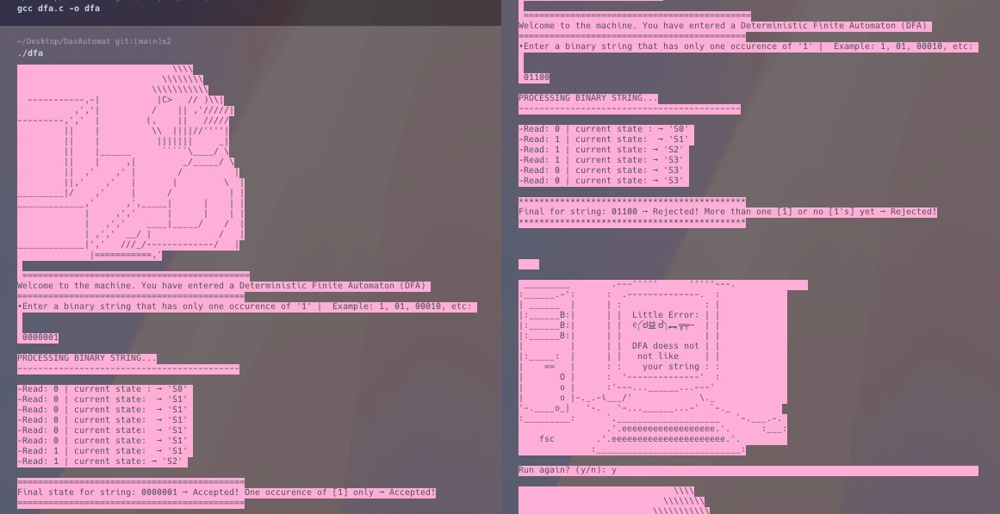
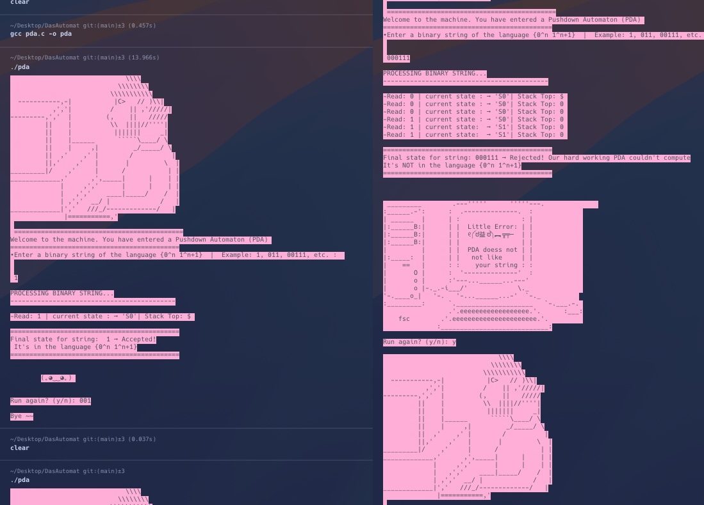
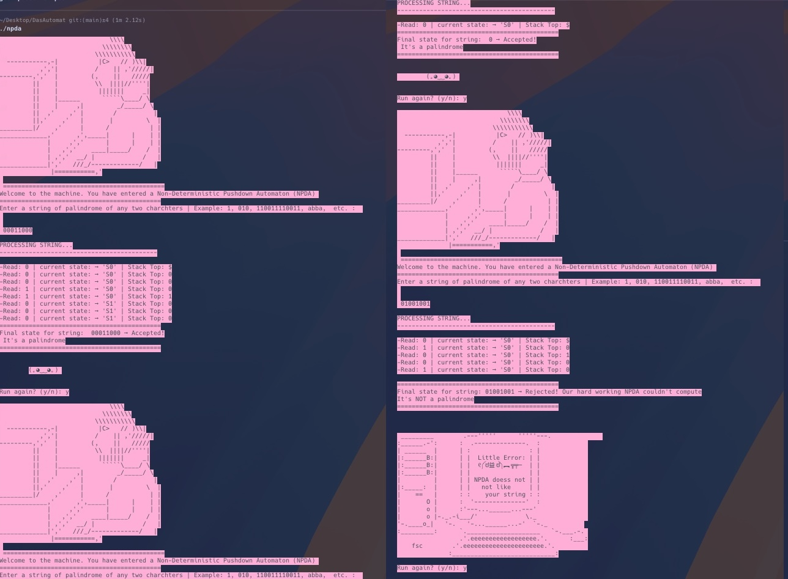

# DFA-PDA-NPDA

Deterministic Finite Automaton (DFA), Pushdown Automaton (PDA), and Non-deterministic Pushdown Automaton (NPDA) simulation in procedural style programming.

## Demonstrations

### Deterministic Finite Automaton (DFA)


### Pushdown Automaton (PDA)


### Non-deterministic Pushdown Automaton (NPDA)


---

## Usage Guide (Mac/Linux/Windows)

Clone:

```sh
git clone https://github.com/gammaploid/POP_DFA-PDA-NPDA.git
```

After cloning, navigate into the project directory:

```sh
cd POP_DFA-PDA-NPDA
```

### Compile

To compile any of the automaton programs, open your terminal in the project directory and run:

```sh
gcc dfa.c -o dfa
gcc pda.c -o pda
gcc npda.c -o npda
```

### Run

After compiling, run the desired automaton:

```sh
./dfa    # For the DFA 
./pda    # For the PDA 
./npda   # For the NPDA
```

Each program will prompt you for input and display results in the CLI with example of accepeted strings by the the state machines. You can run multiple tests in a row by entering `y` when prompted.

---

## License

This project is licensed under the MIT License - see the [LICENSE](LICENSE) file for details. 